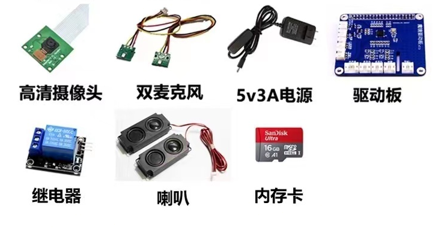
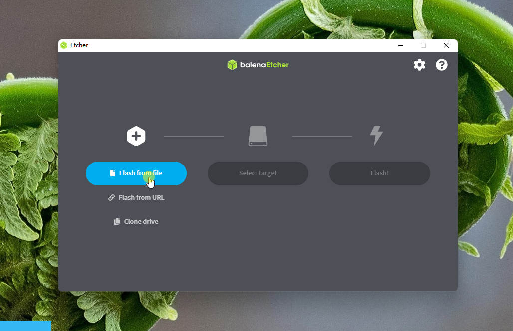

<p align="center">
    
    
  	<a href='https://www.zhihu.com/people/zi-mei-ren-gong-zhi-neng-xi-tong-50'></a>
    
    <a href='https://github.com/drbdrb/zimei'></a>
</p>

# 自美人工智能学习交流系统
**一个实用的智能物联网系统，快速入门物联网，立即拥有你自己的人工智能。**

# 📋简介

> ZimeiOS是基于Python为主语言，结合：微信小程序、HTML5、CSS3、Javascript、VUE支持、云端服务器等技术构建的智能物联网系统。

​        ZimeiOS为一个**简单的、多功能的、跨平台、易扩展**的智能物联网学习交流系统，适合人工智能个人爱好者、学生、企事业单位小型人工智能物联网项目等群体快速入门智能物联网系统，系统内置了语音对话、后台管理、微信小程度互联、单片机互联等功能，通过下载安装或自定义开发插件的方式无限扩展到具体需求中使用。

## 🗃 设备支持

**Zimei OS目前支持以下多个系统平台：**

- 🍓 ARM架构平台：树莓派系列：3B、3B+、4B、 Zero 2w、香橙派等其他支持安装linux系统的开发板
- 💻 X86电脑架构平台：Win7、Win10_x32位、Win10_x64位、Ubuntu_x64位
  - 注：在Windows系统下是采用虚拟机中安装Ubuntu系统的方式来运行的
- 🖥 MacOS 同样需要在虚拟机安装Ubuntu系统来体验zimeiOS系统。


## 🎬 适用场景

 - 中小学生学习物联网知识辅助系统
 - 物联网、人工智能爱好者二次扩展开发使用
 - 大学生参与人工智能、物联网相关竞赛或作为毕业设计辅助系统
 - 企事业单位小型人工智能、物联网项目延伸扩展开发使用
 - 学校、培训机构学习人工智能和物联网课程辅助系统

## ⚙️系统内置功能

#### 💭 唤醒功能

唤醒包括：单唤醒，多唤醒，特定人唤醒，唤醒识别。通过唤醒词快速唤醒设备，以控制设备功能开关。
例如:  通过唤醒词控制设备开关灯。


#### 💭 语音识别

语音识别，包括听写、语法识别功能。通过语音识别功能与设备简单交流，执行自定义任务。
例如: 通过语音交流查询地方天气，新增日记，定闹钟，询问今日气温湿度，日期时间，查看市场走势，监控电力系统。

#### 💭 语音合成

语音合成，又称文语转换技术，是将文字信息转化为可听的声音信息（即音频数据）。
例如:播报天气信息、播报新闻、播报设备状态。

#### 💭 移动端互联

​通过客户端或小程序软件连接到设备，管理设备。
例如: 管理设备设置、控制设备开关。

#### 💭 单片机互联

通过物联网技术控制多个单片机设备，支持多业务多终端任务快速下发。
例如: 批量部署物联网设备，针对某个终端下发业务。

#### 💭 模块化开发

功能以插件的形式提供，用户可以快速改变增减修改插件功能。

#### 💭 插件式定制

插件可以针对不同需求用户定制、插件独立式运行，完全可以使用一个插件实现一套系统，也可以多插件耦合形成体系开发。

#### 💭 云端管理

通过web管理的方式管理设备，随时随地了解设备状态，也可以通过内网穿透功能使用手机端远程管理。

----

# 🍓 在树莓派等ARM架构设备上安装系统

## ✳️ 一、硬件准备

​		**在开始之前需要准备以下必要硬件设备**

### 💭 树莓派3B / 3B+ / 4B/ Pi Zero / 香橙派 等设备


### 💭 配件：树莓派自美驱动板或其它兼容的声卡

   ​建议使用我们经过各项测试的自美声卡驱动板，稳定高拓展，购买链接：[科艺创想声卡驱动板](https://m.tb.cn/a.ZRs8?scm=20140619.pc_detail.itemId.0&id=600751373947)
 

   > ##### ⚠️您也可以自行购买声卡设备，但是可用性，稳定性不做保证。

### 💭 其它设备:SD卡、读卡器、设备电源等

还需要准备 **不少于16GB**容量的MicroSD存储卡，TF读卡器  ，对应的树莓派电源适配器您可以通过我们官方店铺直接购买，购买链接[科艺创想人工智能配件商城](https://16302.taobao.com/shop/view_shop.htm?spm=a230r.1.14.102.732f3d2eVZex92&user_number_id=21770462)


> ✨如果你希望有**开箱即用的体验**可以购买我们已经准备好的套件，店铺链接[点此购买]()

### 💭外设设备：键盘、鼠标、显示器

📣 如果你需要直接操作树莓派设备，需要自行准备⌨️ 键盘 🖱️ 鼠标 🖥️ 显示器

---

## ✳️ 二、获取ZimeiOS系统方法

### 💬 方法一、购买成品SD卡(推荐，更方便、更稳定)

我们已经准备好了全新的SD卡套件，您可以直接在我们的淘宝店铺购买，到手即用。[科艺创想人工智能配件商城](https://16302.taobao.com/category.htm?spm=a1z10.1-c.w4010-22051699663.2.763d6a2daLEplk&search=y)

### 💬 方法二、自行烧录系统手动安装

#### 🗯 1. 下载软件及镜像包
首先，如果你手头上有一张空闲的MicroSD卡(至少16G以上，建议选用品质好一点的高速卡)，且有充足的时间，那么你可以自行烧录系统。
首先我们需要下载好烧录软件Etcher，你可以通过⏬[https://www.balena.io/etcher/](https://www.balena.io/etcher/)找到它，下载下来，并安装，它是一款支持多平台的烧录软件。

接下来，需要先从开发板官方网站下载最新稳定版本的系统保存在你电脑上熟悉的位置。

#### 🗯 2. 开始烧录

第一步：**将MicroSD卡插入读卡器并连接到你的电脑上**，之后打开etcher   >找到[**Flash from file**]按钮  > 选择之前下载的镜像文件 > 点击打开

第二步：点击[**Select target**]按钮 > 选择你的SD卡名 > 点击[Select] 完成选择

第三步：点击[**Flash!**]按钮开始刻录系统，**如果弹出UAC警告，点击[YES]同意即可**



> 通常烧录会花费5-10分钟，等出现[**Flash another**]烧录的过程已经完成了,可以关闭烧录软件了，接下来你需要准备好开始**配网工作**了

#### 🗯 3. 配置网络连接
> 接下来的安装工作都需要使用到网络，所以需要配置网络连接。为了更好、更快速的安装系统，建议先使用网线方式接下，速度和稳定性都比较高。

**一、使用有线网线接入**

如果你使用的是**有线网络接入**，通过网线连接树莓派设备，那么你**无需配网**，设备会自动获取IP地址。

**二、使用WiFi网络接入（以树莓派系统为例）**

以下配置wifi方式是以树莓派设备为例，如其他设备请查阅相关开发板的说明文档

1. 打开  >此电脑（或者使用快捷键Win+E）>打开[**Boot**]驱动器
如果你在此电脑中没有看到[Boot]，请将读卡器拔出重新插入电脑即可。
2. 点击查看 > 显示 >勾选文件拓展名(用于显示文件拓展名)
3. 点击新建> 文本文档 >修改文件名为 **`wpa_supplicant.conf`**


打开 **`wpa_supplicant.conf`** 复制以下内容并**修改你使用的WiFi名称和密码到文件中来**

```shell
ctrl_interface=DIR=/var/run/wpa_supplicant GROUP=netdev
update_config=1

network={
    ssid="你自己用的WiFi名称"
    #key_mgmt=WPA-PSK
    psk="你自己用的WiFi密码"
}
```


4. 配网完成
至此，无桌面环境下WiFi配置就完成了，如果你在配网完成后依然无法连接网络，请检查你的网络类型是否为2.4G频段，**树莓派设备对于Wifi5和Wifi6设备 5Ghz频段支持不佳。**

#### 🗯 4. 安装自美系统
> 系统启动后打开系统中的终端窗口（如果你有一定的linux基础，可以打开SSH，使用SSH工具连接到设备上原理相同）你可以使用以下命令来安装自美系统：
```shell
python3 <(wget -qO- https://a.16302.com/install)
```
根据安装工具提示一步一步的安装完成即可。

## ✳️ 三、开始体验!

​**如果你已经配置好了网络连接并且成功安装好系统，那么你可以开始体验自美系统了！**

### 💭 语音对话

> **在系统配置完成联网后会自动发出“*我已经准备好了*”语音提示**

此时您已经可以与设备进行语音对话了

如果等待五分钟后仍然未能启动成功，首先请**检查您的配网文件是否正确**，你可能需要重新配网。如果配置正确且依然无法开机，*请连接显示器 键盘 鼠标与有线网线进行排错*。

### 💭 使用客户端连接

#### 通过 [下载客户端]() 配置连接到设备

----------

# 🖥 在普通电脑设备上安装系统

> 在普通PC上暂时无法体验完整开发功能，如GPIO功能，仅可作为体验用。

### ✳️ 一、硬件准备

#### 💭 系统硬件配置要求

> Windows推荐配置:
> 处理器：四核及以上处理器
> 内存条：8GB及以上RAM
> 存储器：40GB可用空间
> 图形卡：支持OpenGL 3.3以上显卡

---

> Mac端推荐：
> MacBook Air 2015款及以上
> 系统推荐为MacOS Bigsur 11.2
> 可用内存大于4GB

---

> Linux推荐：
> 处理器：四核及以上处理器
> 内存条：8GB及以上RAM
> 存储器：40GB可用存储空间
> 图形卡：支持OpenGL 3.3以上显卡

#### 💭 系统软件要求

* Windows 10 1903 x64 及Windows 11 x64（需要虚拟机支持）
* MacOS 10.15+ (需要虚拟机支持)
* Ubuntu 21.10 x64

#### 💭 软件要求

* VMware Workstation Pro (适用Windows)
* Oracle VM VirtualBox (适用Windows)
* Parallels Desktop (适用MacOS)

> 以上虚拟机软件选择一个适合你的即可

### ✳️ 二、Linux操作系统安装

#### 💬 方法一、物理真机上安装Linux操作系统

##### 自行安装Ubuntu 21.10操作系统


> 下载链接 [https://releases.ubuntu.com/21.10/ubuntu-21.10-desktop-amd64.iso](https://releases.ubuntu.com/21.10/ubuntu-21.10-desktop-amd64.iso?_ga=2.235810625.1526846142.1647931835-1641275256.1642693956)


#### 💬 方法二、在虚拟机里安装Linux操作系统

##### 自行安装虚拟机


##### 安装Ubuntu 21.10操作系统


### ✳️ 三、安装自美系统

安装完Ubuntu 21.10后打开终端窗口，执行以下命令：

```shell
python3 <(wget -qO- https://a.16302.com/install)
```
根据一键安装工具提示，一步一步完成安装。

### ✳️ 四、开始体验自美系统

#### 1️⃣ 启动虚拟机

* 首先你需要启动系统

#### 2️⃣ 语音对话


> **在系统配置完成联网后会自动发出“*我已经准备好了*”语音提示**

🎙 **此时您已经可以与设备进行语音对话了**

‼️ 如果等待五分钟后仍然未能启动成功，首先请**检查您的网络是否正常**，你可能需要重新联网。如果配置正确且依然无法开机，*请进入系统进行排错*。

#### 3️⃣ 使用客户端连接

* 通过客户端配置连接到设备

## 前端界面客户端下载

[Windows x64✅](down.16302.com/rasberry/osdown)

[MacOS x64✅(M1设备未经测试)](down.16302.com/rasberry/osdown)

[Ubuntu 21.10✅](down.16302.com/rasberry/osdown)

# 🍻支持我们

> **如果您对这个项目感兴趣，请Star它，如果您在使用中发现了问题，欢迎您提交问题。**

我们为普通用户提供免费的体验，您也可通过[升级服务]()提升您的用户体验，以下图表展示了各个版本的区别。

# 📑License

> 本项目遵从gpl-3.0协议开源 [gnu/gpl-3.0](https://www.gnu.org/licenses/gpl-3.0.txt)
